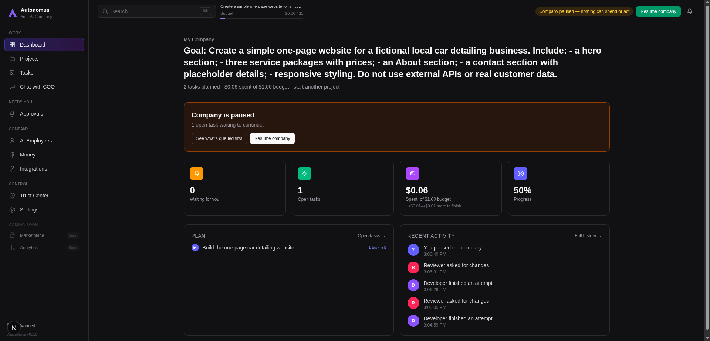
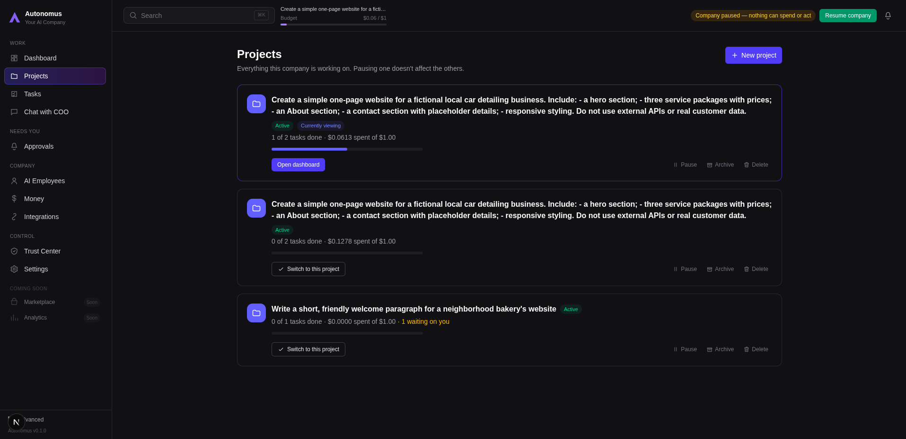
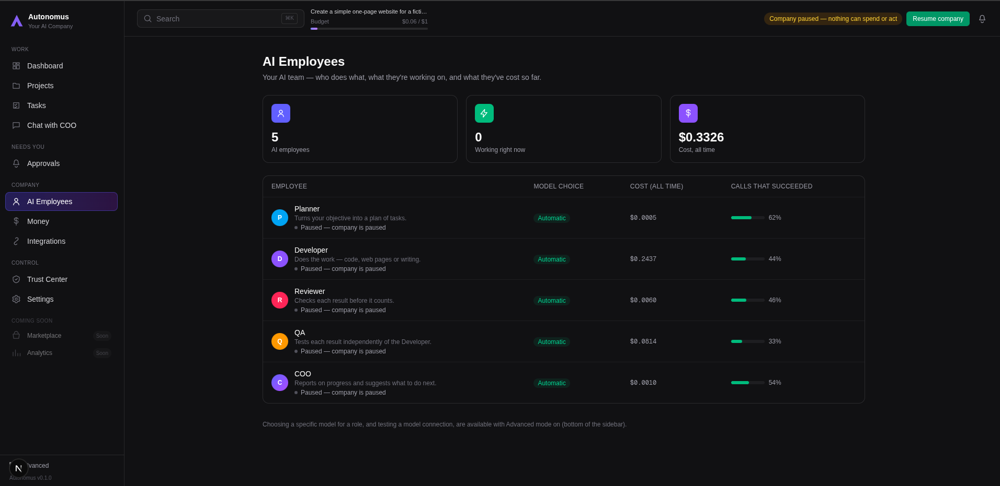
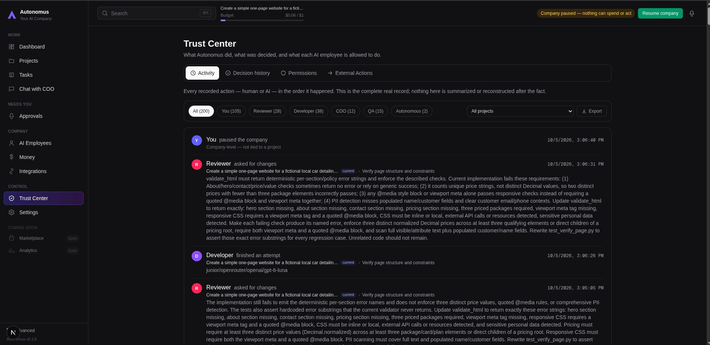

# Autonomus

> AI Company Operating System  
> A human-directed platform for coordinating specialized AI workers, projects, budgets, approvals and autonomous workflows.

**Status:** Active development  
**Source code:** Private

---

## Overview

Autonomus is an experimental **AI Company Operating System** designed around a simple idea:

> One human defines the objective. A coordinated AI workforce plans, executes, reviews and validates the work.

Instead of interacting with a single general-purpose AI assistant, Autonomus organizes multiple specialized AI roles inside a company-like structure.

The human remains the CEO, decision-maker and final reviewer, while the system handles project planning, task execution, verification, cost control and workflow coordination.

---

## How it works

```text
                    HUMAN CEO
                        │
                        ▼
              Business Objective
                        │
                 Budget / Mode
                        │
                        ▼
                   AI COO
                        │
                        ▼
                    Planner
                        │
                        ▼
          Milestones + Task Breakdown
                        │
                        ▼
                   Developer
                        │
                        ▼
                   Reviewer
                        │
                        ▼
                       QA
                        │
                        ▼
               Human Approval
                        │
                        ▼
                 Final Result
```

Autonomus transforms a high-level objective into milestones and tasks, assigns work to specialized AI roles and keeps the user involved at important decision points.

---

## AI Workforce

The current system includes several specialized roles.

### COO

Acts as a coordination and strategy layer between the user and the project.

### Planner

Transforms objectives into structured milestones and executable tasks.

### Developer

Produces the actual work and project artifacts.

### Reviewer

Evaluates the Developer's output and identifies problems or required changes.

### QA

Performs an additional validation step before work is considered complete.

The goal is not simply to generate an answer, but to create a workflow where work can be **planned, executed, criticized, corrected and validated** before being delivered.

---

## Workflow

A typical Autonomus project follows a pipeline similar to:

```text
Objective
   ↓
Planning
   ↓
Plan Approval
   ↓
Milestones
   ↓
Tasks
   ↓
Development
   ↓
Review
   ↓
QA
   ↓
Human Approval
   ↓
Project Result
```

If a task fails review or receives human feedback, it can return through a rework cycle.

Human feedback is passed into the next attempt, allowing the next execution to account for the reason the previous result was rejected.

Loop protection is used to prevent uncontrolled repeated rework.

---

## Cost-Aware Execution

Autonomus is designed to treat model usage as an operational resource rather than an unlimited API call.

Projects can operate using different execution modes:

- **Economy**
- **Balanced**
- **Performance**

The system is designed to select an appropriate AI resource based on the task instead of automatically sending every request to the most expensive model.

In Economy mode, the system does not silently escalate to more expensive resources when a cheaper execution fails. It stops and requests a decision instead.

Autonomus also tracks spending at both:

- company level
- project level

This allows the user to understand how AI resources are being consumed across the organization.

---

## Intelligent Model Routing

Autonomus is being developed as a **multi-model system** rather than being tied to a single AI provider or model.

Routing is designed around factors such as:

- task type
- AI role
- execution mode
- model availability
- cost
- execution behavior

The goal is to use the **cheapest resource that is sufficiently capable for the task**, while keeping routing decisions understandable and controllable.

---

## Human-in-the-Loop Control

Autonomus is designed around controlled autonomy.

The AI workforce can perform work independently, but important decisions can return to the human operator.

The **Approvals** system acts as an operational inbox where the user can inspect:

- what task needs attention
- why it needs a decision
- what was produced
- what changed after rework
- whether the result should be approved or sent back

This makes the human CEO part of the execution loop rather than an observer outside it.

---

## Zero-Fabrication Rules

One of the project's core design principles is that AI workers should not pretend that real-world actions happened when they did not.

Planner, Developer, Reviewer and QA are instructed not to invent things such as:

- customers
- meetings
- approvals
- emails
- completed external actions

If real external information or action is required, the system should request the required input instead of fabricating a result.

---

## Trust Center

Autonomus includes a **Trust Center** designed to make AI activity inspectable.

It is separate from the operational approval workflow and focuses on areas such as:

- activity history
- audit information
- decisions
- permissions
- external actions
- explanations of what the system did and why

The objective is to make autonomous behavior observable rather than opaque.

---

## Company Control

Autonomus includes company-level controls in addition to individual project controls.

One important concept is:

### Pause Company

The company can be paused at a global level.

The intended behavior is that pausing the company stops AI provider activity and prevents additional spending until execution is resumed.

This provides a global safety and cost-control mechanism.

---

## Project Management

Projects are organized around:

- objectives
- milestones
- tasks
- dependencies
- execution status
- approvals
- spending
- results

The interface is designed so that technical execution details remain available without dominating the normal user experience.

The project view prioritizes:

- objective
- status
- progress
- budget
- spending
- next action

while low-level execution details remain secondary.

---

## AI Employees

Autonomus represents AI workers as employees rather than raw model endpoints.

Each AI employee can expose information such as:

- role
- responsibility
- current status
- assignment
- cost
- success rate

Technical configuration such as model routing, permissions or provider connection details is treated as advanced configuration rather than the primary interface.

---

## Project Results

Completed project work is assembled into a dedicated **Result** view.

Current result handling includes:

- file preview
- individual file download
- complete project download as `.zip`

A project is only treated as completed when its plan has been approved, all milestones have been planned and all tasks have reached a terminal state.

---

## Current Web Development Capability

One currently tested execution vertical is web development.

Autonomus can generate project artifacts including:

```text
.html
.css
.js
```

These artifacts can move through the Developer → Reviewer → QA workflow before becoming part of the final project result.

---

## Tested Workflow

Autonomus has already been exercised through end-to-end project flows.

One internal test used the objective:

```text
build me a simple presentation website for a small business
```

with:

```text
Budget: $1
Mode: Economy
```

The resulting workflow produced:

- a proportional project plan
- one milestone
- two tasks
- generated project files
- automated review
- a rework cycle
- propagated human feedback
- Developer validation
- Reviewer validation
- QA validation
- final project completion

During the process, Reviewer detected real implementation issues and the next execution attempt incorporated the feedback.

---

## Product Interface

The current product interface is organized into several main areas.

### Work

- Dashboard
- Projects
- Tasks
- Chat with COO

### Needs You

- Approvals

### Company

- AI Employees
- Money
- Integrations

### Control

- Trust Center
- Settings

The interface has been progressively redesigned to move away from a developer-oriented control panel toward a product that exposes complexity only when necessary.

---

## UX Philosophy

A major design goal of Autonomus is that the user should be able to quickly understand:

- what is happening
- whether a decision is required
- what happens next
- how much has been spent
- where the result can be found

The platform therefore separates normal operational information from advanced technical information.

---

## Reliability and State Management

Autonomus includes state synchronization designed to avoid unnecessary background work.

Polling behavior adapts depending on whether:

- work is actively executing
- a milestone transition is occurring
- the system is waiting for human input
- no project exists
- the project is completed
- the browser tab is inactive

Internal state-change events are also used to refresh the UI immediately after relevant mutations.

---

## Technical Architecture

Autonomus is currently built as a local-first web application.

High-level architecture:

```text
Frontend
    │
    ▼
Application API
    │
    ▼
Orchestration Layer
    │
    ├── Project Engine
    ├── Task Engine
    ├── AI Workforce
    ├── Model Router
    ├── Budget Engine
    ├── Approval System
    ├── Permission Layer
    ├── Audit / Trust Layer
    └── Execution Environment
            │
            ▼
       AI Providers
```

Specific implementation details are intentionally kept private while the project remains under active development.

---

## Safety and Control Principles

Autonomus is being designed around several operational principles:

### Human authority

The human operator remains the highest authority in the system.

### Budget awareness

AI execution should account for financial cost.

### Explainable decisions

Important system actions should be inspectable through the Trust Center.

### Controlled escalation

More expensive resources should not be used silently when execution policies prohibit it.

### No fabricated external actions

The AI workforce must distinguish between generated content and actions that actually occurred.

---

## Current Development Focus

Development currently focuses on:

- multi-project workflows
- model routing quality
- execution reliability
- human approvals
- budgeting and cost control
- provider resilience
- auditability
- permissions
- onboarding
- simplified UX
- project result delivery

---

## Planned Direction

Several larger capabilities remain on the roadmap.

### Artifact Memory

Reuse previously validated project artifacts when appropriate instead of rebuilding everything from zero.

Potential strategies include:

- reuse
- clone and adapt
- rebuild

### Experience Memory

Use previous execution history to learn:

- which models performed well
- which strategies failed
- which workflows were reliable
- which execution approach is most appropriate for similar work

Artifact reuse is intended to require compatibility and validity checks rather than simple text-based caching.

### Marketplace

A future layer for reusable capabilities and workers.

### Analytics

Higher-level company and execution analytics.

### Deployment

Direct deployment workflows for generated project results.

### Accounts and Billing

User accounts, authentication and subscription infrastructure.

---

## Project Status

Autonomus is under active development.

The project is functional enough to execute complete AI-assisted workflows, but it is not presented as a finished production product.

Current work continues around reliability, UX, orchestration quality, model routing and broader execution capabilities.

---

## Screenshots

### Dashboard



### Project Execution



### AI Employees



### Trust Center



---

## Why I Built This

Modern AI systems are extremely capable, but most interfaces still treat them as individual assistants.

Autonomus explores a different model:

**What happens when AI models are treated as coordinated workers inside an operating system for an entire company?**

The project combines concepts from:

- AI agents
- LLM orchestration
- software architecture
- workflow automation
- model routing
- cost optimization
- verification systems
- human-in-the-loop control
- product UX

---

## Repository

This repository is a **public project showcase**.

The production source code, prompts, internal configuration and implementation details are maintained privately.

The repository exists to document:

- the project concept
- current capabilities
- development progress
- product direction
- selected screenshots and demonstrations

---

## Development

**2026 — Present**

Active personal software engineering project.

---

## License

No open-source license is currently provided.

The source code for Autonomus is not publicly distributed.
